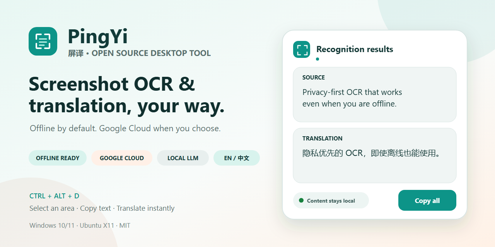
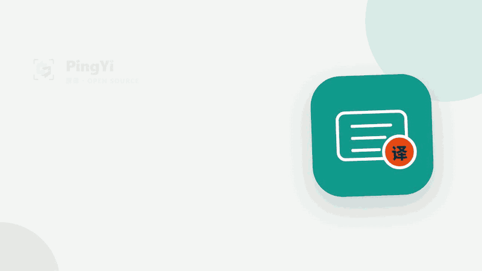

<p align="center">
  
</p>

<h1 align="center">PingYi Screen Translator</h1>

<p align="center"><strong>An open-source, privacy-first screenshot translator and OCR text extractor that works offline out of the box</strong></p>

<p align="center">
  <a href="README.md">简体中文</a> · <a href="README.en.md">English</a>
</p>

<p align="center">
  <a href="https://github.com/qingshihuan/pingyi/actions/workflows/ci.yml"></a>
  <a href="https://github.com/qingshihuan/pingyi/releases"></a>
  <a href="https://github.com/qingshihuan/pingyi/stargazers"></a>
  <a href="LICENSE"></a>
  
  
</p>

<p align="center">
  
</p>

PingYi is a desktop screen translator for Windows 10/11 and Ubuntu X11. Press `Ctrl+Alt+D`, select any screen region, and get OCR text extraction and translation in one compact result card. The interface is available in English and Simplified Chinese and can follow the operating-system language automatically.

The standard package bundles local OCR and basic Chinese-English translation models. It works on a new computer without internet access, a discrete GPU, Python, or a preinstalled .NET runtime. The Complete edition additionally bundles the Vulkan and CPU llama.cpp runtimes and can download and configure newer lightweight multimodal models from ModelScope in one click. Existing Ollama, LM Studio, vLLM, llama.cpp, and generic Chat Completions services remain supported. For broader cloud language coverage, you can supply your own Google Cloud or Baidu credentials.

If PingYi helps your screenshot-OCR or translation workflow, please [star the repository](https://github.com/qingshihuan/pingyi). It makes this privacy-first alternative easier for other users to discover.

## PingYi in 24 seconds

<p align="center">
  
</p>

The demo covers region capture, OCR results, translation, and local privacy status. Download [v0.3.0](https://github.com/qingshihuan/pingyi/releases/tag/v0.3.0); the Standard edition provides offline Chinese-English essentials immediately after installation.

## Why PingYi

- **One-step screenshot translation:** select a region with a global hotkey and see the source text and translation immediately.
- **OCR text extraction:** copy text from images, video subtitles, desktop applications, and non-selectable web pages.
- **Local multimodal OCR:** use a vision model through llama.cpp, Ollama, LM Studio, or vLLM directly, or let it correct a PaddleOCR draft.
- **Real offline fallback:** bundled PaddleOCR ONNX and Argos Translate provide Chinese-English OCR and translation without network access.
- **Local LLM enhancement:** supports llama.cpp, Ollama, LM Studio, vLLM, and generic OpenAI-compatible endpoints. The default automatically detects the source, translates foreign text to Simplified Chinese and Chinese to English, and still offers 34 explicit target languages.
- **Privacy first:** local mode uploads nothing and stores no screenshots, recognized text, translations, or history by default.
- **Optional cloud providers:** configure Google Cloud Vision OCR, Google Cloud Translation, Baidu services, or a custom Chat Completions endpoint when desired.
- **English and Chinese UI:** follow the system language or explicitly choose English or Simplified Chinese in Settings.
- **Cross-platform desktop app:** built with Avalonia and C# for Windows x64 and Ubuntu X11 x64.
- **Self-contained releases:** Windows installer/portable ZIP and Ubuntu `.deb`/`.tar.gz`, with no separate runtime installation.

## Download and use

Download the edition for your system from [GitHub Releases](https://github.com/qingshihuan/pingyi/releases):

| Edition | File prefix | Best for | First run |
| --- | --- | --- | --- |
| Standard | `PingYi-` | Smallest package, offline zh-en fallback, or an existing Ollama/llama.cpp service | Offline OCR and basic zh-en translation work immediately |
| Complete | `PingYi-Complete-` | PingYi-managed multimodal models and llama.cpp | Core features work immediately; the enhancement model is downloaded once from ModelScope |

On Windows, prefer `*-win-x64-setup.exe` or use the portable ZIP. On Ubuntu X11, install the `.deb` or extract the `.tar.gz`. The two editions use separate installation and data directories, so they can coexist without overwriting the previous release.

On Windows, the installer creates both Start Menu and desktop shortcuts; the ZIP remains portable. Start PingYi, press `Ctrl+Alt+D`, and drag to select a screen region. Each monitor receives a coordinated overlay at its own DPI, including negative-coordinate and cross-screen selections. The result card lets you copy the source text, translation, or both; retry processing; or pin the card, and later captures reuse the same result window instead of stacking new windows. Manage the hotkey, OCR/translation providers, local models, and credentials in Settings. Credential fields expose only a show/hide control; once shown, standard copy and paste commands work inside the text box.

> Windows SmartScreen may show an unknown-publisher warning because the current open-source release does not yet use a paid commercial code-signing certificate. Download only from this repository's Releases page and verify the files with the supplied SHA-256 checksums.

## Local, cloud, and GPU boundaries

| Capability | Default implementation | Network | Compute |
| --- | --- | --- | --- |
| Screenshot OCR | PaddleOCR + ONNX Runtime | No | CPU |
| Local multimodal OCR/correction | Vision model with compatible `image_url` input | No | Chosen by the external server; the model's vision components must be loaded |
| Basic zh-en/en-zh translation | Argos Translate | No | CPU |
| Local LLM translation | llama.cpp / Ollama / LM Studio / vLLM | No | Chosen by the external server; multilingual quality depends on the model |
| Baidu OCR | Baidu position-aware OCR | Yes; selected image only | Cloud |
| Baidu/custom translation | Baidu Translate or Chat Completions | Yes; recognized text only | Cloud |
| Google OCR | Cloud Vision API | Yes; selected image only | Cloud |
| Google translation | Cloud Translation Basic v2 | Yes; recognized text only | Cloud |

The standard package includes no proprietary NVIDIA CUDA/cuDNN, AMD, or Intel GPU acceleration runtime. The offline translation engine includes the CPU/OpenMP dependencies required by its official CTranslate2 platform wheel, including Intel oneMKL and oneDNN on x64; every artifact includes the applicable EULA, open-source licenses, and third-party notices. The Complete edition additionally adds the MIT-licensed llama.cpp Vulkan/CPU runtimes and does not bundle CUDA, cuDNN, or ROCm. The Ubuntu `.deb` installs the OpenSSL, Vulkan loader, GNU OpenMP, and C++ system runtimes required by llama.cpp. Vulkan supports compatible AMD, NVIDIA, and Intel GPUs. An external local model server may use its own acceleration stack independently. Core features and Complete edition CPU mode work without a GPU.

## Configure Google Cloud OCR and translation

1. Enable the [Cloud Vision API](https://cloud.google.com/vision/docs) and [Cloud Translation API](https://cloud.google.com/translate/docs/basic/translating-text) in your own Google Cloud project.
2. Create an API key and restrict it to those two APIs. Add application or source restrictions when your deployment allows them.
3. Open **Settings → Google Cloud OCR and Translation credentials**, select **Show**, paste the key, and choose **Save and verify Google credentials**.
4. Select `Google Cloud Vision OCR` or `Google Cloud Translation` under Processing engines. Either can be combined with a local or another cloud provider.

The key is stored with Windows DPAPI or Linux Secret Service and is never written to `settings.json`. OCR validation sends only a built-in transparent 1×1 test image; translation validation sends the fixed word `test`. During real use, a screenshot is uploaded only when Google OCR is selected, while Google Translation receives recognized text only. Enablement, quotas, and charges remain under your Google Cloud project.

## Complete edition one-click local models

Open **Settings → Complete edition · one-click local multimodal model**, select a model and runtime backend, then choose **Download and configure**. Downloads resume after interruption and are checked against pinned file sizes and SHA-256 hashes. Model weights are not stored in this Git repository or bundled in the installer.

| Model | Download | Suggested hardware | Positioning |
| --- | ---: | --- | --- |
| Qwen3.5 2B Q4 (recommended) | about 1.82 GiB | 4 GB VRAM may work, 6 GB is safer; CPU supported | New 2026 model with balanced OCR, translation, and multilingual ability |
| Qwen3.5 2B Q8 | about 2.50 GiB | 6 GB+ VRAM recommended; CPU supported | Higher language precision and small-text correction |
| Gemma 4 E2B Q4 | about 3.17 GiB | 8 GB VRAM recommended; CPU supported | 2026-06 model with image understanding and 140+ pretraining languages |

Runtime choices:

- **Auto detect (recommended):** try the general Vulkan GPU backend first, then fall back to CPU.
- **General GPU · Vulkan:** use an AMD, NVIDIA, or Intel GPU and report an error instead of falling back.
- **CPU only:** slower, but maximizes compatibility and portability.

The managed service listens only on local address `127.0.0.1:18080`; local mode does not upload screenshots or text. Pinned ModelScope sources: [Qwen3.5 2B GGUF](https://modelscope.cn/models/unsloth/Qwen3.5-2B-GGUF) and [Gemma 4 E2B GGUF](https://modelscope.cn/models/ggml-org/gemma-4-E2B-it-GGUF).

## Implemented features

- Windows virtual-desktop capture, global hotkey, multi-monitor selection, and mixed-DPI handling.
- Ubuntu X11 screenshot and global-hotkey implementation through Xlib.
- PP-OCRv5 mobile Chinese/English models, ONNX Runtime CPU inference, and SHA-256 model integrity verification.
- Bundled Argos Chinese-English fallback with automatic recovery when a local LLM is unavailable.
- Google Cloud Vision OCR, Google Cloud Translation Basic v2, Baidu position-aware OCR, Baidu general translation, and custom Chat Completions translation.
- Presets for llama.cpp, Ollama, LM Studio, vLLM, and generic OpenAI-compatible services.
- Local multimodal OCR plus a PaddleOCR + vision-model correction mode for small text, terminals, and unusual fonts.
- Copy source/translation/all, retry, pin, tray mode, and light/dark themes.
- Single-instance operation: later launches wake the existing window or forward capture/settings commands instead of creating duplicate background processes; every processing task is cancelable and time-bounded.
- Task-focused home screen, separate Settings window, contextual repair cards, and an optional classic interface.
- English and Simplified Chinese interfaces with automatic system-language selection.
- Windows DPAPI and Linux Secret Service credential storage, with masked display, reveal, copy, and paste controls.
- Compatible custom services may use HTTP only on loopback addresses; every non-loopback endpoint must use HTTPS so credentials, recognized text, and images are never sent in plaintext.
- Zero history by default; logs exclude screenshots, recognized text, translations, and secrets.
- Update checks are off by default and contact the network only after the user explicitly enables them in Settings.

## Current compatibility

- Windows 10/11 x64.
- Ubuntu 22.04+ X11 x64; Wayland screenshot portals are outside the v1 scope.
- PaddleOCR and bundled Argos translation support Simplified Chinese and English; local/custom LLM translation offers 34 common target languages in Settings. Text automatically detected as another language is never sent to the Chinese-English Argos fallback.
- v1 does not include live overlay translation, PDF/image batch processing, specialized table/formula OCR, or history.

## Run from source

Install the [.NET 10 SDK](https://dotnet.microsoft.com/):

```powershell
dotnet build PingYi.slnx
dotnet run --project src/PingYi.App/PingYi.App.csproj
```

Local OCR does not need Python during development. To run the standalone Argos translation engine:

```powershell
.\scripts\setup-engine.ps1
```

Append `--settings` to open Settings directly for troubleshooting. Use `--capture` to forward a capture command to an already-running instance.

## Test and release

```powershell
dotnet test PingYi.slnx
py -3 -m unittest discover -s engine_host -p "test_*.py"
py -3 -m unittest discover -s scripts -p "test_*.py"
.\scripts\run-quality-baseline.ps1 -ModelDirectory <prepared-offline-model-directory>
.\scripts\publish.ps1 -Runtime win-x64
```

See the [quality baseline](docs/QUALITY_BASELINE.md) for deterministic OCR scores, the translation comparison, and release dependency auditing. Release builds contain a trimmed self-contained .NET app, a minimized standalone translation engine, and the offline models. The build fails if it detects NVIDIA/CUDA/cuDNN, an unexpected Torch runtime, or a missing third-party license. Every artifact contains a complete `licenses/` directory; the Complete edition retains only the files needed by llama.cpp server.

If Inno Setup is installed in a custom directory, pass `-InnoCompiler "D:\path\to\ISCC.exe"`. To prepare model sources on a release machine:

```powershell
python scripts/download-offline-models.py --destination artifacts/model-source
```

To build the Complete edition, prepare the pinned llama.cpp CPU/Vulkan runtime as well:

```powershell
py -3 scripts/prepare-llama-runtime.py --runtime win-x64 --destination artifacts/llama-runtime/win-x64
.\scripts\publish.ps1 -Runtime win-x64 -Version 0.3.0 -Edition Complete -OfflineModelSource artifacts/model-source -LlamaRuntimeSource artifacts/llama-runtime/win-x64
```

Windows builds optionally support Authenticode. Import a code-signing certificate into the current-user certificate store and pass its SHA-1 thumbprint; omitting it continues to produce unsigned artifacts:

```powershell
.\scripts\publish.ps1 -Runtime win-x64 -BuildInstaller `
  -SigningCertificateThumbprint <40-character-thumbprint> `
  -TimestampUrl https://timestamp.digicert.com
```

GitHub Release can use repository secrets `PINGYI_SIGNING_CERTIFICATE_BASE64` (a Base64-encoded PFX) and `PINGYI_SIGNING_CERTIFICATE_PASSWORD`. Without them, the workflow neither requires nor fabricates a certificate. Build jobs have read-only repository access; only the final publishing job can write a Release.

Pushing a `v*` tag builds the Windows installer/ZIP and Ubuntu `.deb`/`.tar.gz`, generates SHA-256 checksums, and creates a GitHub Release.

## Contributing

Bug reports, OCR failure samples, translation feedback, feature requests, and pull requests are welcome. Read [CONTRIBUTING.md](CONTRIBUTING.md) and [SECURITY.md](SECURITY.md) first. Redact private information before sharing screenshots; the project will never ask you to upload secrets or private captures.

## License

PingYi source code is available under the [MIT License](LICENSE). Offline models and third-party runtime components retain their respective licenses; see [third-party notices](THIRD_PARTY_NOTICES.md). The installed `licenses/` directory contains the complete texts and manifest for the components in that particular build.
