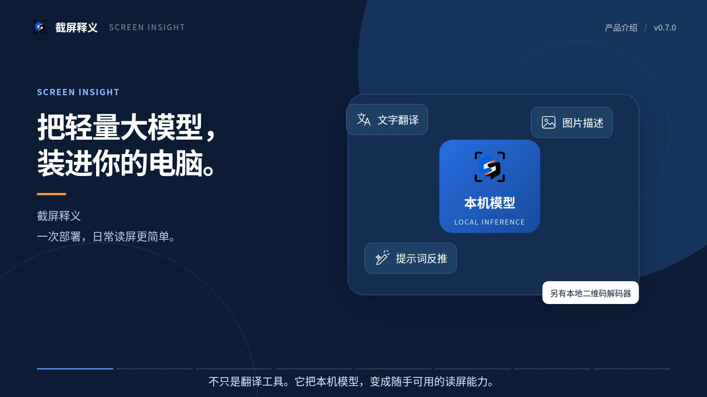
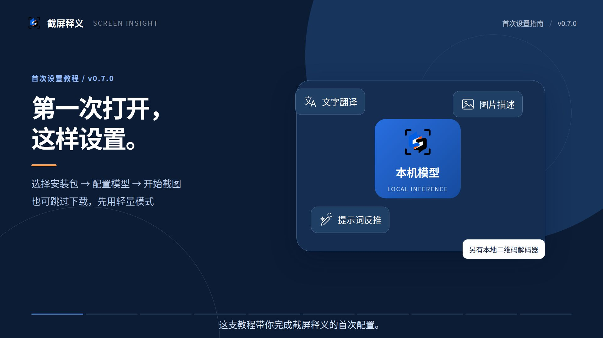
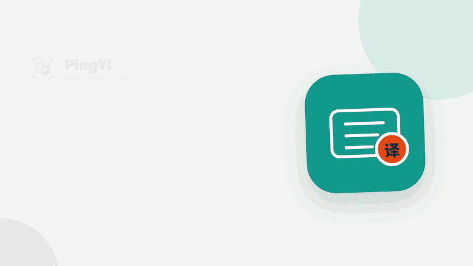

<p align="center">
  
</p>
<h1 align="center">截屏释义</h1>
<p align="center"><strong>一次截图，读懂内容。</strong></p>
<p align="center">自动选择文字翻译、图片描述或二维码解析 · 本机模型优先 · Windows / Ubuntu</p>
<p align="center"><a href="README.md">简体中文</a> · <a href="README.en.md">English</a></p>
<p align="center">
  <a href="https://github.com/qingshihuan/pingyi/releases/latest"></a>
  <a href="https://github.com/qingshihuan/pingyi/actions/workflows/ci.yml"></a>
  <a href="LICENSE"></a>
</p>
<p align="center"><a href="https://github.com/qingshihuan/pingyi/releases/latest"><strong>下载正式版</strong></a> · <a href="#quick-start">快速开始</a> · <a href="#docs">使用与开发文档</a> · <a href="https://github.com/qingshihuan/pingyi/issues">反馈问题</a></p>

截屏释义（原 PingYi／屏译）是一款桌面截图识别工具。点击“一键识别”并框选屏幕，软件先在本地检查文字与二维码，再选择文字翻译、图片描述或二维码解析。判断不明确时由你选择；结果窗口始终保留手动任务切换，使用同一张截图，无需重新框选。

**v0.7.0 已加入自动任务、基础／轻量模式与首次模型配置引导；安装包功能以对应 Release 说明为准。**自动选择是基于可见内容的启发式推荐，不是对用户意图或识别准确率的保证。[完整规则、升级与验证边界](docs/AUTOMATIC_CAPTURE.md)

<!-- screen-insight-videos:start -->
## 软件介绍与设置视频下载

**一键部署本机轻量大模型，让截图翻译、图片描述和参考提示词成为桌面常用能力。二维码由独立的本地解码器处理，不需要模型。**

| 软件介绍 · 60 秒 | 首次设置 · 1 分 50 秒 |
| --- | --- |
| [](https://github.com/qingshihuan/pingyi/raw/refs/heads/main/docs/videos/screen-insight-intro-zh-CN.mp4) | [](https://github.com/qingshihuan/pingyi/raw/refs/heads/main/docs/videos/screen-insight-setup-zh-CN.mp4) |
| [下载介绍 MP4](https://github.com/qingshihuan/pingyi/raw/refs/heads/main/docs/videos/screen-insight-intro-zh-CN.mp4) | [下载设置 MP4](https://github.com/qingshihuan/pingyi/raw/refs/heads/main/docs/videos/screen-insight-setup-zh-CN.mp4) |

**点击封面或下方链接下载 MP4，再用本地播放器打开。GitHub 文件预览页不提供这两支视频的在线播放；“文件过大，无法显示”不代表视频损坏。**

Remotion 制作，1080p／30fps，中文字幕与原创配乐，无旁白。使用 v0.7.0 原生界面和合成示例；流程动画不是实测耗时。[下载、播放说明与源码](docs/videos/README.md) · [旧版升级与重启排障](docs/WINDOWS_UPGRADE.md)

<!-- screen-insight-videos:end -->

<a id="download"></a>
## 下载与安装

前往 **[GitHub Releases 最新正式版](https://github.com/qingshihuan/pingyi/releases/latest)**，展开 **Assets** 并选择程序包；GitHub 自动生成的 `Source code` 是源码，不是安装程序。

从 v0.6.0 起仅分发完全版，文件名前缀为 `PingYi-Complete-`。Windows 10/11 x64 提供 `*-win-x64-setup.exe` 与便携 ZIP；Ubuntu 22.04+ x64 提供 DEB 与 tar.gz。共 4 个程序包，附 `SHA256SUMS.txt`。DEB 声明系统图形库等依赖，安装缺失依赖时可能需要联网。

安装包包含应用运行时、轻量 OCR／中英翻译模型，以及 llama.cpp CPU／Vulkan 运行时；不需要另装 Python 或 .NET。**大模型权重不在安装包内**，由用户在引导页选择下载。基础／轻量是软件内的处理模式，不是两个安装版本，也不会改变现有完全版数据目录。旧标准版数据留在原目录，不会自动迁移或删除。

> 请仅从本仓库 Releases 下载并核对 SHA-256。未签名 Windows 构建可能触发 SmartScreen；校验和核对文件完整性，不替代代码签名。

<a id="quick-start"></a>
## 首次使用

1. **选择处理模式。**首次打开软件显示模型配置引导：可一键下载并配置基础模式，连接已有本机服务，或选择“暂不下载，使用轻量模式”。没有点击下载就不会自动下载大模型。
2. **框选屏幕。**点击“一键识别”或按截图快捷键。正常探测到文字时进入翻译，二维码可直接在本地解码；文字与二维码混合或证据不足时显示任务选择。
3. **查看或改选结果。**随时切换为文字翻译、图片描述、二维码解析或手动提示词反推。切换会取消前一任务，复用原截图，防止旧结果覆盖新选择。关闭结果窗口结束这张截图的会话。

| 处理模式 | 识别与翻译 | 使用条件 |
| --- | --- | --- |
| **基础模式（新安装默认）** | 本地自定义大模型 OCR → 本地自定义大模型翻译 | 支持图片输入的本机模型及视觉组件；可由引导页一键配置 |
| **轻量模式** | PaddleOCR → Argos Translate | 安装包内的中英基础模型，无需下载大模型或独立显卡 |
| **其他组合** | PaddleOCR＋大模型翻译、百度或自定义提供商组合 | 根据选择配置模型或云端凭据；不会标为本机基础模式 |

已删除“PaddleOCR＋大模型纠错”和“视觉纠错”方案。**基础模式直接把截图交给视觉模型转录，不先生成 PaddleOCR 初稿让模型纠正。**自动任务判断仍可使用本地 PaddleOCR 探测文字；这是分流步骤，不是纠错链。选择轻量模式后，图片描述仍需要另外配置视觉模型。

引导页展示模型下载量、许可、来源与设备提示。点击下载后才从魔搭获取并校验模型，启动本机服务，以固定合成图片和短句检查 OCR／翻译接口，成功后保存基础模式配置。取消或失败不标记配置完成，可重试或使用轻量模式；已下载部分保留以便续传。该连接检查不代表真实截图准确率或所有设备性能已验收。

已有配置升级时保留原 OCR／翻译选择、端点、模型、语言和快捷键；只有旧纠错 OCR ID 迁移为直接视觉 OCR，不强制覆盖其他偏好。主界面的“模型配置引导”可随时重新打开。

### 截图与自定义快捷键

| 桌面 | 默认入口 |
| --- | --- |
| Windows | `Ctrl+Alt+D` 或主界面按钮 |
| Linux X11 | `Ctrl+Shift+D` 或主界面按钮 |
| Linux Wayland | 主界面按钮；系统全局快捷键需在桌面键盘设置中绑定截图命令 |

主界面“自动判断任务”可关闭，关闭后主按钮／默认快捷键直接执行文字翻译；手动翻译、图片描述、二维码和提示词入口始终保留。

在 **设置 → 外观与启动** 手动输入快捷键，或点击“录入快捷键…”后按组合，Enter 确认、Esc 取消，最后“保存并应用”。恢复默认同样需要保存。支持 Ctrl／Alt／Shift 中至少一个修饰键加 A–Z 或主键盘 0–9；不支持 Super、功能键和小键盘键。录入期间暂停软件自身的原生绑定，结束后恢复保存的组合；注册冲突会提示并尝试恢复旧键。

### Ubuntu Wayland

Wayland 使用公开 XDG Screenshot portal，不读取 XWayland 根窗口；需要 `xdg-desktop-portal` 和匹配后端（Ubuntu GNOME 通常为 `xdg-desktop-portal-gnome`）。应用内保存快捷键只是偏好，不是系统注册成功。复制设置页的截图命令，在系统 **键盘 → 自定义快捷键** 中显式绑定；软件不会覆盖桌面绑定。其他程序与个人配置可能占用相同组合。[Linux 依赖与排障](docs/LINUX_CAPTURE.md)

<a id="features"></a>
## 桌面能力

**自动任务与手动纠正。**一次框选可用于翻译、描述或二维码；含多个二维码时可选择结果。二维码不需要大模型或 API，解码不会自动打开网址，只有明确点击才交给浏览器。[二维码说明](docs/DESKTOP_QR.md)

**直接视觉 OCR 和翻译。**支持 llama.cpp、Ollama、LM Studio、vLLM 等兼容 Chat Completions 服务。基础模式仅接受本机回环端点；远程端点归入自定义组合。识别质量与语言范围取决于所选模型。轻量模式继续提供中英离线兜底。

**图片描述与提示词。**需要兼容 `image_url` 的视觉模型，文字模型不能替代。“反推提示词”是手动任务，生成相似画面的参考描述，不恢复原始提示词、种子或生成参数。[图片分析说明](docs/IMAGE_ANALYSIS.md)

**桌面交互。**中英文切换、浅深色主题、独立分类设置、托盘与可复用结果卡。支持多显示器框选，具体混合 DPI、输入法和桌面环境仍需实机验证。

<details>
<summary>早期工作流演示</summary>

<p align="center"></p>

演示来自旧版本，不能代表当前界面、处理模式或 Linux 默认键。当前用法以上文为准。

</details>

<a id="models"></a>
## 本机模型与云服务

**本机模型：**首次引导或 **设置 → 本地模型** 可下载、配置。自动后端优先尝试 Vulkan，失败时回退 CPU；显式选 Vulkan 时不自动切换。下载量和设备提示见软件目录，速度与内存需求以实际设备为准，不承诺所有模型适用于所有硬件。

**已有服务：**在 **设置 → 自定义接口** 填写本机兼容端点、模型名和所需凭据，确认模型支持视觉输入。模型配置之后按需加载；切换自动任务开关不会主动启动大模型。

**可选云服务：**在 **设置 → 云端服务** 配置自己的 Google Cloud 或百度凭据，并在识别与翻译中分别选择提供商。费用、配额和服务条款由用户自己的账户承担。非回环自定义端点必须使用 HTTPS，不能用明文 HTTP 传输截图或文字。

<a id="privacy"></a>
## 数据去向

| 场景 | 数据边界 |
| --- | --- |
| 自动任务探测、二维码、轻量 OCR／翻译 | 本机处理，探测不访问云端、不下载模型 |
| 基础模式／本机模型 | 图片和文字交给配置的本机服务；独立模型服务的日志和联网行为取决于其自身设置 |
| 自动选择了远程 OCR 或翻译 | 执行前单独确认本次数据去向；拒绝不发送 |
| 远程图片描述／提示词 | 每次请求及重试确认接收端点与模型，不沿用文字翻译授权 |

截图、文字、分析结果及二维码载荷不写入历史或日志；同图切换的探测缓存仅保留在内存会话中。凭据使用 Windows DPAPI 或 Linux Secret Service，不写入普通设置文件。自动更新检查默认关闭；明确下载模型、主动检查更新及使用远程服务会联网。

系统与外部服务有独立的留存边界：Wayland 门户可能创建截图文件，软件仅清理临时目录副本，不保证删除桌面保存到其他位置的文件；远程和自行部署服务也可能记录请求。

## 浏览器插件：开发冻结

保留已有 Chrome／Edge 插件及桌面 Native Messaging／当前用户命名管道连接，不新增插件功能，不推进商店上架，也不开放 TCP 监听。插件及原生连接组件仍需单独构建和注册，桌面安装包不会自动安装插件。API 密钥不复制到浏览器，远程 OCR 每张图片单独确认。插件已有正文、选区与悬停翻译等功能及网页限制，以 [插件文档](browser-extension/README.md) 为准；本次不修改插件协议。

<a id="docs"></a>
## 使用、开发与验证

[自动任务与首次引导](docs/AUTOMATIC_CAPTURE.md) · [Linux 截图](docs/LINUX_CAPTURE.md) · [二维码](docs/DESKTOP_QR.md) · [图片分析](docs/IMAGE_ANALYSIS.md) · [性能](docs/PERFORMANCE.md) · [质量基线](docs/QUALITY_BASELINE.md) · [版本记录](docs/releases)

正式平台范围为 Windows 10/11 x64 和 Ubuntu 22.04+ x64。macOS、ARM 及其他 Linux 发行版不在当前声明的正式支持范围内。当前不包含实时覆盖翻译、PDF／图片批处理、表格／公式专项识别或持久历史。自动分流、OCR 和模型输出可能错误，请使用手动切换并核对结果。

开发需要 .NET 10 SDK；独立 Argos 引擎需要 Python 3.13。在仓库根目录执行：

```sh
dotnet restore PingYi.slnx
dotnet build PingYi.slnx
dotnet run --project src/PingYi.App/PingYi.App.csproj
```

源码构建需要另行准备模型、翻译引擎和 llama.cpp；缺少 llama.cpp 时引导禁用下载配置，仍可选择已有本机服务或轻量模式。`--settings` 打开设置，`--capture` 从首次或已有实例发起截图。

<details>
<summary>测试与打包命令</summary>

Windows 使用 `scripts/setup-engine.ps1`，Linux 使用 `scripts/setup-engine.sh` 准备翻译环境。本地 PaddleOCR 不依赖 Python，但需要模型。

```sh
dotnet test PingYi.slnx
python -m unittest discover -s engine_host -p "test_*.py"
python -m unittest discover -s scripts -p "test_*.py"
python scripts/download-offline-models.py --destination artifacts/model-source
```

模型准备会联网，Windows 可用已配置的 `py -3` 替代 `python`。完全版打包示例（PowerShell）：

```powershell
$version = (Get-Content .github/release-version.txt -Raw).Trim()
.\scripts\setup-engine.ps1
python scripts/prepare-llama-runtime.py --runtime win-x64 --destination artifacts/llama-runtime/win-x64
.\scripts\publish.ps1 -Runtime win-x64 -Version $version -Edition Complete `
  -OfflineModelSource artifacts/model-source `
  -LlamaRuntimeSource artifacts/llama-runtime/win-x64 -BuildInstaller
```

Inno Setup 非默认位置可传 `-InnoCompiler`；质量基线使用 `scripts/run-quality-baseline.ps1 -ModelDirectory <模型目录>`。可选签名参数为 `-SigningCertificateThumbprint` 与 `-TimestampUrl`，仓库机密名为 `PINGYI_SIGNING_CERTIFICATE_BASE64` 和 `PINGYI_SIGNING_CERTIFICATE_PASSWORD`。不要提交模型、截图、凭据或证书。

发布仅由版本标签或 `.github/release-version.txt` 的主线变更触发；双平台构建、测试、4 个 Complete 包核验和许可证审计通过后发布。现有标签指向其他提交时不得覆盖。此次功能开发不自动修改版本或替换已有 Release。[完整工作流](.github/workflows/release.yml)

</details>

自动化包括纯策略、配置迁移、合成模型响应、界面和隔离 Xvfb／D-Bus 原生检查；**不等于真实模型准确率、物理 GNOME／Wayland、多屏或所有显卡已验收**。

## 贡献与许可

欢迎通过 Issue／PR 反馈，先阅读 [贡献指南](CONTRIBUTING.md) 与 [安全策略](SECURITY.md)，不要上传私人截图、识别正文或凭据。源码采用 [MIT License](LICENSE)，模型和第三方组件保留各自许可，见 [第三方声明](THIRD_PARTY_NOTICES.md) 及成品 `licenses/` 清单。

## 退出与显存释放

点击主窗口底部或托盘的 **“退出并释放资源”**，停止截屏释义及由它启动的模型后端，等待进程结束后退出。
关闭主窗口到托盘仍会保留后台运行，不等于退出。外部自行运行的 Ollama／LM Studio 等服务不会被误关，
模型文件与设置不会删除。显存由操作系统与驱动在后端退出后回收，不保证显卡总占用归零。
[退出行为、后端所有权与验证范围](docs/RUNTIME_SHUTDOWN.md)。这部分为源码改动，安装包以对应 Release 为准。

## 显卡与运行后端（当前源码）

首次引导和设置 → 本地模型新增显卡检测、执行显卡选择与后端下载安装。自动模式参考 NVIDIA 架构和驱动选择 CUDA 12／13，AMD 尝试 ROCm/HIP；保留 Vulkan／CPU。手动显卡或后端选择不会静默改用其他设备。显示的是当前后端实际枚举的设备，不使用系统显示器序号。

点击下载／配置才联网查询官方稳定版及对应二进制；GitHub 不通时使用内置可信版本清单（明确不是已确认最新版）。可主动允许第三方备用下载源，连接／读数据超时后换源，始终校验官方文件大小与 SHA-256。不会安装显卡驱动，正常截图不检查更新。

模型推理使用独立客户端，不再被通用 30 秒 HTTP 期限提前中断；主翻译和轻量回退使用独立期限。翻译失败后重试可复用本次截图的 OCR，识别设置变化或成功后重新处理则重新识别。基础模式与手动任务保持不变。

这些是分支／源码能力，安装包以 Release 为准。支持条件、来源、实际验证与限制见 [运行后端说明](docs/RUNTIME_ACCELERATION.md)。
